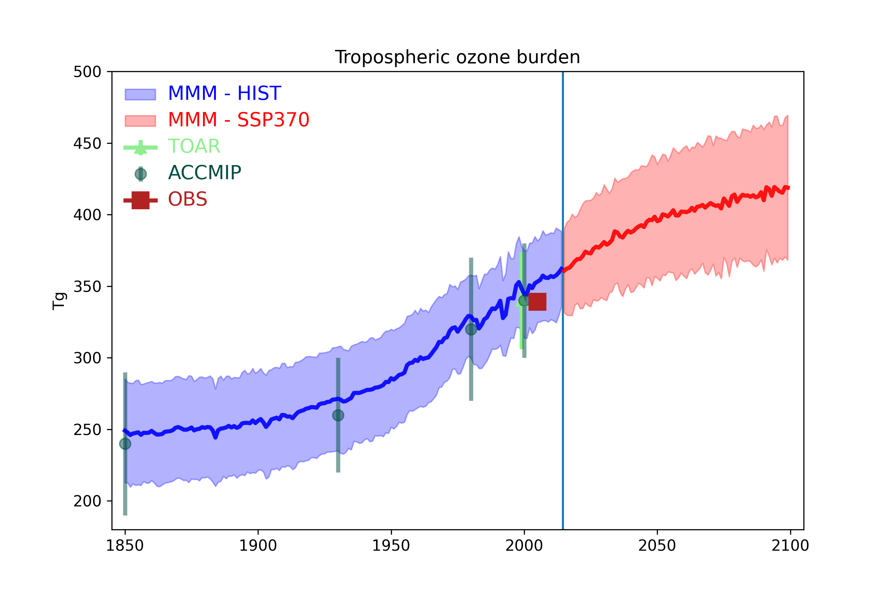

# CMIP6 tropospheric ozone burden

This folder contains code used to generate figure 6.6 of Chapter 6 in IPCC AR6 WG1 report.  Code was written by Paul Griffiths and Youngsub Matthew Shin, Cambridge University.

## Python environment

- Code is written in Python 

- Data analysis scripts were run within the JASPY scientific stack, specifically jaspy/3.7/r20210320 from https://github.com/cedadev/ceda-jaspy-envs/commit/bc6390455685cb4a83da0b6a5d96eff7385f71f2

- Specific packages used at time of analysis also detailed in requirements.txt, the environment can be recreated using 

     ``` pip install -r requirements.txt ```

# Location of data
Code was designed to run on a node connected to the ESGF data archive.  On BADC, the structure of the data directory is

   $DATA_ROOT/MIP_ERA/ACTIVITY/INSTITUTION_ID/MODEL_ID/EXPERIMENT_ID/VARIANT_LABEL/FREQUENCY/VARIABLE/GRID_LABEL/ 
   
   but other paths may be supplied by the user

# Code to calculate burden

run this script using 

    python calc_tropospheric_ozone_burden.py

data is output to data/ subdirectory

# Code to plot burdens

run this script using

    python plot_tropospheric_ozone_burdens.py

# Final output

